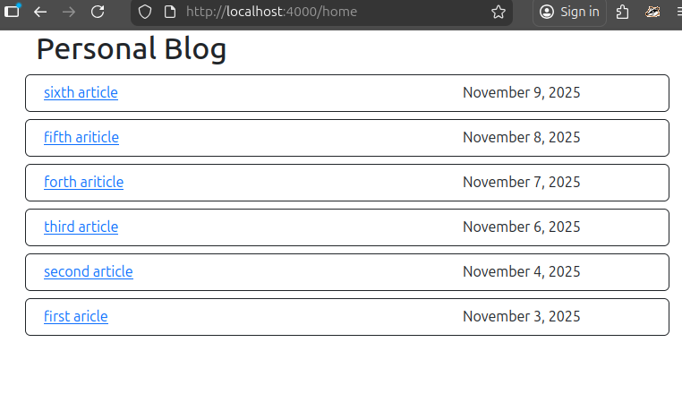
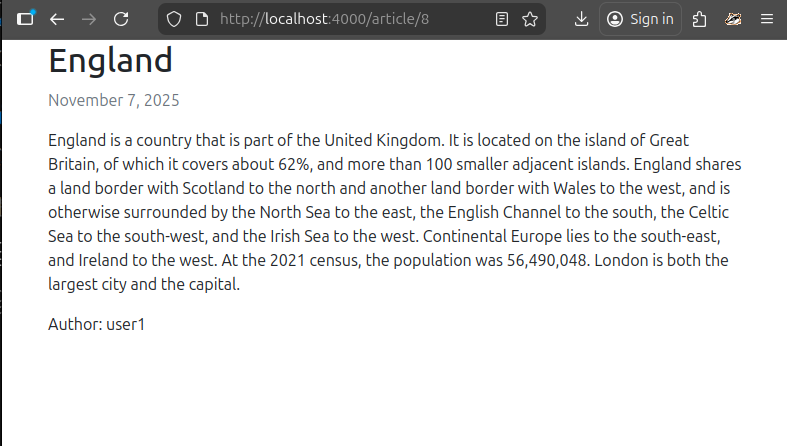
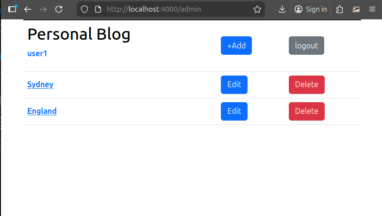
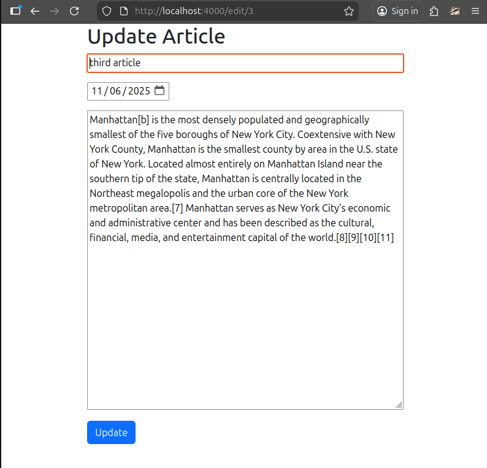

# personal_blog
This repository is a implementation of roadmap.sh backend project (https://roadmap.sh/projects/personal-blog).

This frontend and backend is implemented by html(plus ejs for templating) and node.js respectively.
framework bootstrap is used.

please follow the instructions to run:
1. download and unzip the code
2. open terminal and go the project folder
3. type `npm install` in terminal to install the neccessary node package
4. type `node index.js` to run the backend. [do not run with `nodemon`. `nodemon` will re-start after writing or deleting file (create a new article, save modifed an article and delete an article). It needs to log in again when `nodemon` will re-start.]
5. Port `${PORT}` is opened. Use web browser to open `http://localhost:${PORT}/home` to view the articles as a guest.
6. To create, edit or delete articles, go to `http://localhost:${PORT}/login` to login as admin (username and password is stored in index.js for simplicity).

home page (guest)

article content

admin page

edit article

This project use `express-session` to store user login status. Any access to `/admin`, `/edit/x` and `/new` page as guest will be redirected to `/login` page.

The newest article (published date) will be listed at the top in `/home` and `/admin` page. The order of article will be sorted before display when a new article has been published or an existing article has been editted each time.