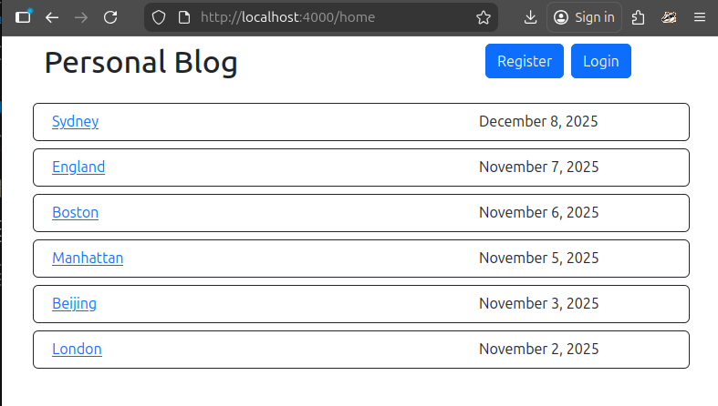
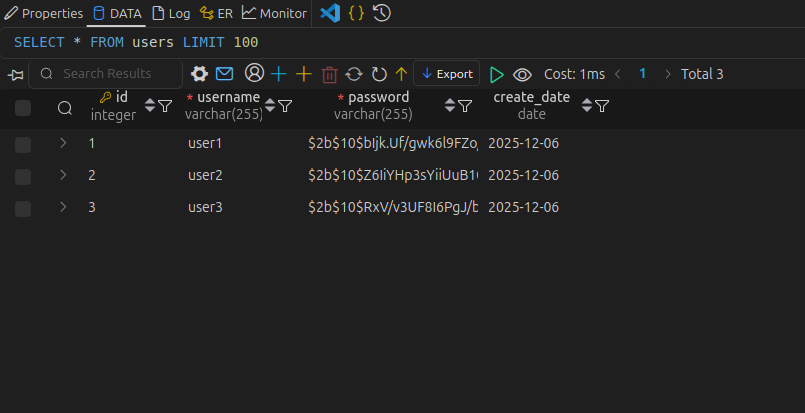
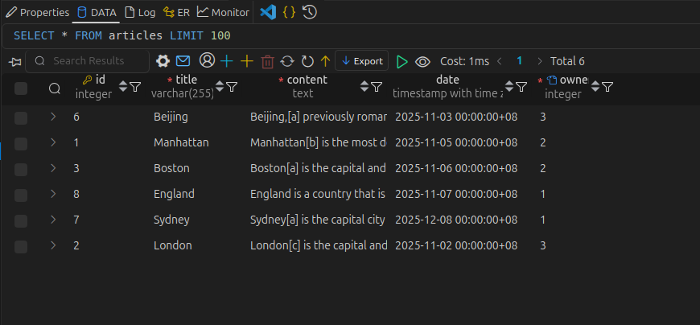

# personal_blog
This repository is an improvement of roadmap.sh backend project (https://roadmap.sh/projects/personal-blog).
It adds database PostgreSQL to store the articles, username and the associated password.

This frontend and backend is implemented by html(plus ejs for templating) and node.js respectively.
framework bootstrap is used.

For run the project. Please install `node.js` and `PostgreSQL`.

please follow the instructions to run:
1. download and unzip the code
2. open terminal and go the project folder
3. type `npm install` in terminal to install the neccessary node package
4. follow the command inside queries.sql to set up the tables in databease. 
5. modify the database related variables stored in file `.env`
6. type `node index.js` or `nodemon index.js` to run the backend. 
7. Port `${PORT}` is opened. Use web browser to open `http://localhost:${PORT}/home` to view the articles as a guest.
8. To create, edit or delete articles, go to `http://localhost:${PORT}/login` to login as admin (username and password is stored in index.js for simplicity).

This project use `express-session` to store user login status. Any access to `/admin`, `/edit/x` and `/new` page as guest will be redirected to `/login` page.
User password has beed encryped with module `bcypt`. 
Store the confidential setting(e.g session secret, database login password...) in a hidden file (.env). Normally, `.env` should not be viewed publicly for security. It is included in respository now for demonstration.

home page (guest) - It lists all articles published by all users. The newest article (published date) will be listed at the top of the list.

article content

admin page - It only list the articles that publiched by the login user.

edit article

Users registered in `users` table of the database. User password is encrypted before storing into the tables.

Articles stored in `articles` table of the database
